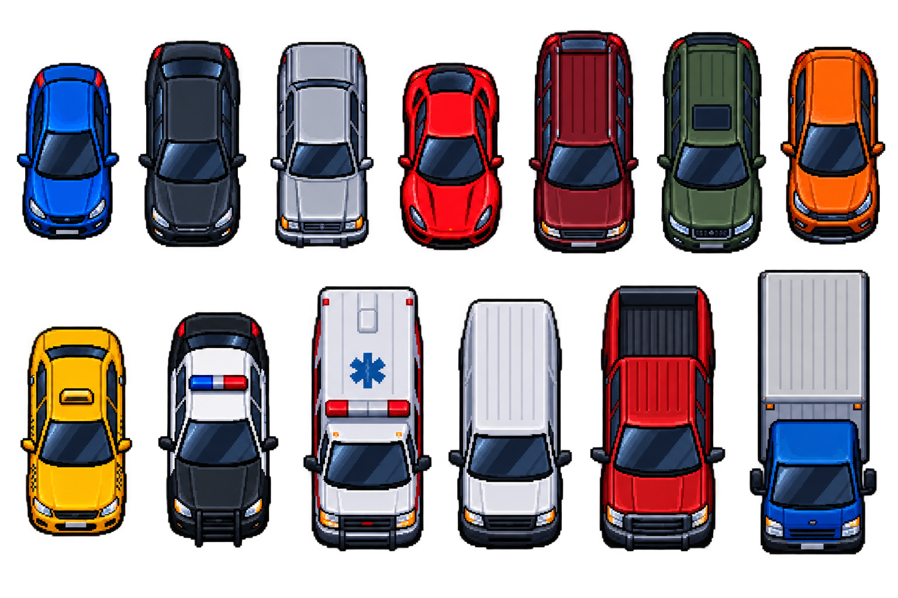

# 🏎️ Unblock & Drift (Godot 4.7.1)

**Unblock & Drift** is a 2-phase mobile arcade puzzle & drift parking game developed in Godot Engine 4.x.



---

## 🎮 Game Flow & Mechanics

The gameplay combines tactical puzzle solving with high-adrenaline physics driving:

### 🧩 Phase 1 — Grid Sliding Puzzle
- **Objective**: Slide vehicles along fixed horizontal or vertical axes to unblock a escape pathway for your target sports car.
- **Constraints**: Move counter tracks each drag operation; reaching 0 moves prompts a rewarded bonus move option.
- **Grid Dynamics**: Parametric grid sizes (4x4 up to 6x8) supporting multi-cell vehicles (Sedans 1x2, Vans 1x3, Buses 1x4).

### 🎬 Phase 3 — Dynamic Transition
- **Seamless Camera Shift**: Smooth camera zoom-in/pan from the puzzle board's exit vector into the starting grid position of Phase 2 with a clean screen transition.

### 💨 Phase 2 — Top-Down Handbrake Drift Parking
- **Objective**: Drive and drift the target car into the marked parking space.
- **Touch Controls**: On-screen Left/Right steering arrows + Handbrake button.
- **Drift Physics**: Holding the Handbrake button dynamically adjusts dynamic damping (`linear_damp` & `angular_damp`), causing lateral drift and emitting tire skid mark FX.
- **Star Rating System**:
  - `Position Overlap (70%)` + `Angle Alignment (30%)` = Combined Score (0-100%)
  - ⭐️⭐️⭐️ **3 Stars**: 85%+ accuracy
  - ⭐️⭐️ **2 Stars**: 60% – 84% accuracy
  - ⭐️ **1 Star**: 35% – 59% accuracy

---

## 📂 Asset Architecture & Folder Structure

```
Unblock & Drift/
├── project.godot                        # Godot 4 project configuration file
├── README.md                            # Documentation
├── park-oyunu-prompt-serisi.md          # 20-Step Asset Prompt Specification & Roadmap
├── assets/
│   ├── vehicles/                        # Short & long top-down vehicle sprite sheets
│   ├── tileset/                         # Asphalt tilemaps & parking spot overlays
│   ├── environment/                     # Concrete barriers, obstacles, decorations, exit markers
│   ├── effects/                         # Skid marks, dust puffs, sparks, celebratory sparkles
│   └── ui/                              # Mobile UI icons, HUD panels, steering/pedal controls
├── scenes/
│   ├── main_menu/                       # Title screen & navigation
│   ├── level_select/                    # Level grid with unlock status & star ratings
│   ├── phase1_puzzle/                   # Phase 1 puzzle board & vehicle drag controllers
│   ├── phase2_driving/                  # Phase 2 physics vehicle & parking checker spot
│   └── ui/                              # Settings menu & level complete overlays
├── scripts/
│   ├── autoload/                        # Singletons (GameManager, SaveSystem, LevelData, etc.)
│   ├── resources/                       # VehicleData & LevelResource classes
│   ├── phase1/                          # GridSystem matrix & VehicleController logic
│   └── phase2/                          # PlayerCarController physics & ParkingSpotChecker
└── resources/                           # Level data definitions (.tres)
```

---

## 🛠️ Getting Started

1. Open **Godot Engine 4.3+** (or **Godot 4.7.1**).
2. Select **Import** and target `project.godot` inside this directory.
3. Press `F5` or click **Play** to run `res://scenes/main_menu/MainMenu.tscn`.

---

## 📄 License
Created for Unblock & Drift mobile game project.
